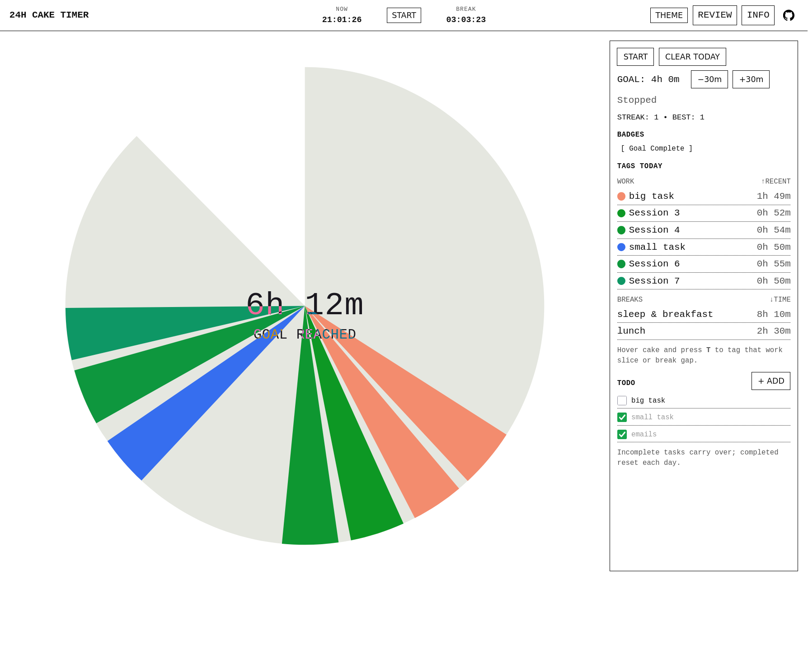
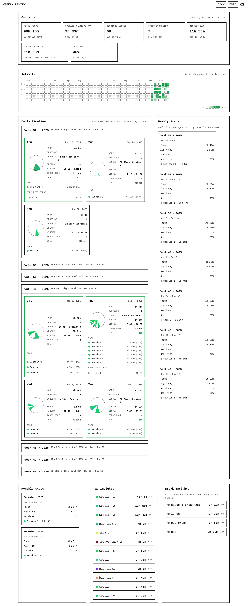

# 24H Cake Timer

**Website:** https://jakobkreft.github.io/CakeTimer/

A minimalist 24-hour “cake” timer for deep work.  
Track sessions, tag slices, review your week, and keep todos. Best part, it's all stored locally in your browser.

## Screenshots

Main timer (index page):


Weekly review (review page):



---

It’s plain HTML/CSS/JS.

```bash
python -m http.server 8080

# Then open:
http://localhost:8080
```
